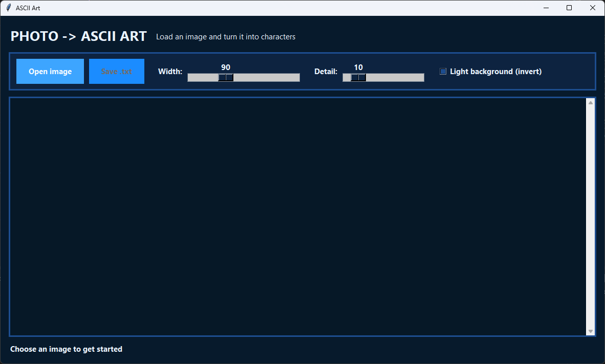

# Photo to ASCII Art

A simple Python application that loads an image and turns it into ASCII art characters.



## Features

- **Graphical User Interface (GUI):** Easy-to-use interface built with Tkinter.
- **Adjustable Settings:** Control the output width and detail level using sliders.
- **Invert Mode:** Toggle the "Light background" option to invert colors (useful for printing on paper or viewing on light themes).
- **Save to File:** Export your generated ASCII art as a `.txt` file.
- **Dark Theme:** Modern and easy on the eyes.

## How to Run

1.  **Clone the repository:**
    ```bash
    git clone https://github.com/Klofik/ascii_art_creator.git
    cd ascii_art_creator
